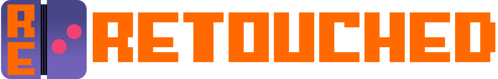

  

> [!NOTE]
> **The Retouched Project and its repositories are not officially supported Nitrome Ltd. or Infrared5 Inc. products.**\
> Several non-Nitrome games supported Brass Monkey, including Rogue Soul, Red Rogue, and in-house titles like Tank vs Alien. 
> Their SWF files were never archived and are currently lost. 
> If you have old cached copies from 2012 to 2015, please contact me in any way to preserve them!

The project that aims to revive Nitrome Touchy/Brass Monkey!

It aims to do this by recreating the ecosystem around Nitrome Touchy/Brass Monkey using modern technologies:
- Bronze Monkey: A Rust library that reimplements the Brass Monkey SDK.
- Retouched Server: An alternative server for the games and controller apps written in Rust.
- Retouched Flutter: A Flutter controller app written in Dart.
- Retouched Web: A React web controller app written in TypeScript.

The reimplementations aim to be compatible with the original apps and games.

## Documentation

You can find the documentation [here](https://retouched-project.github.io/docs/).

## Credits

The project logo uses the font ["Cosimo"](https://fontstruct.com/fontstructions/show/406218/cosimo_1) by Patrick H. Lauke (redux),  
licensed under [Creative Commons Attribution 3.0 Unported](https://creativecommons.org/licenses/by/3.0/).
